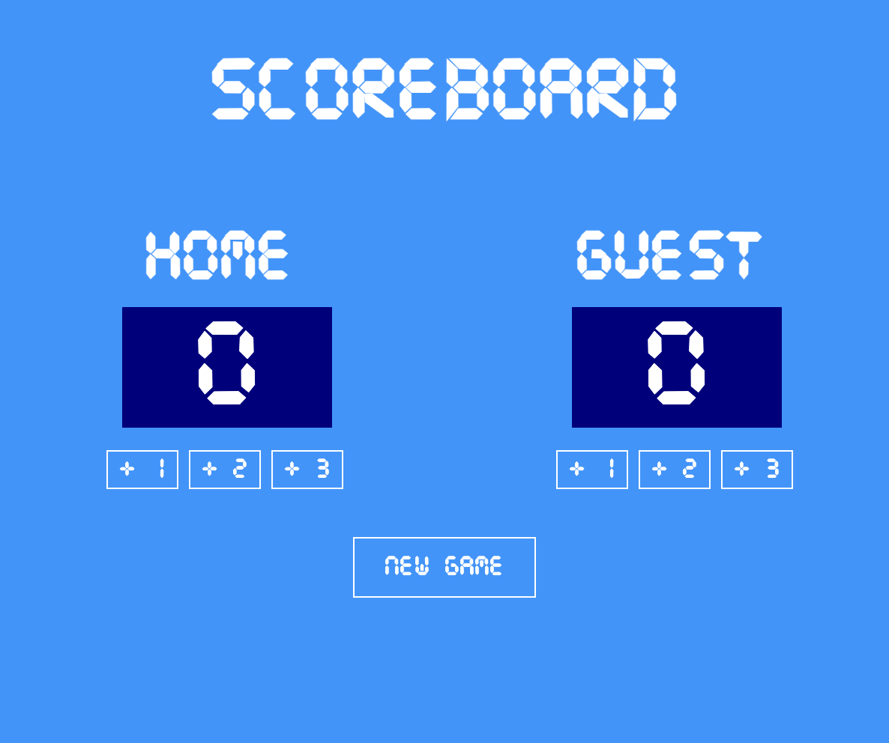

# 🏀 Basketball Scoreboard


A simple and responsive **Basketball Scoreboard** built with **HTML5**, **CSS3**, and **Vanilla JavaScript**. Keep track of the score for both the Home and Guest teams with an intuitive interface and quickly start a new game with a single click.

---

## 📸 Preview



---

## 🚀 Live Demo

[Open the Basketball Scoreboard](https://yamankadoura.github.io/Basketball-scoreboard/)

---

## ✨ Features

- 🏠 Home Team Score Counter
- 🛣️ Guest Team Score Counter
- ➕ Add 1 Point
- ➕ Add 2 Points
- ➕ Add 3 Points
- 🔄 New Game Button (Reset Scores)
- 🎨 Clean Basketball-Inspired Design
- 📱 Responsive Layout
- ⚡ Fast and Lightweight

---

## 🛠 Technologies

- HTML5
- CSS3
- Vanilla JavaScript (ES6)

---

## 📂 Project Structure

```text
basketball-scoreboard/
│
├── index.html
├── index.css
├── index.js
├── README.md
│
└── assets/
    └── screenshot.png
```

---

## 💻 Getting Started

Clone the repository:

```bash
git clone https://github.com/yamankadoura/Basketball-scoreboard.git
```

Navigate into the project:

```bash
cd Basketball-scoreboard
```

Open:

```text
index.html
```

in your browser.
